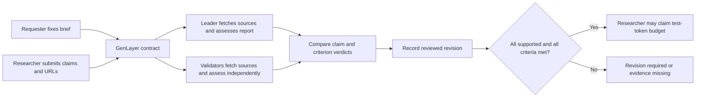

# Architecture

## The decision

GenLayer decides whether a particular report satisfies a fixed research brief. Its accepted decision updates shared contract state and determines whether the assigned researcher may claim the deposited budget. The frontend cannot set a verdict or approve payment.



## State model

`jobs` maps a brief ID to a JSON record. `history` maps `brief-id:revision` to an immutable reviewed snapshot. `ids` supports bounded pagination. Records have explicit owner and researcher addresses, submission and refund deadlines, a decimal-string budget in wei, and a paid flag.

```text
open → submitted → approved → paid
                 → needs_revision → submitted
                 → inconclusive   → submitted

open / needs_revision / inconclusive → refunded after deadline
submitted → refunded after deadline + 7 days
```

Only the researcher submits or claims payment. Only the requester can claim an expired refund. Either party may request a review. Submitted reports cannot be replaced while being reviewed. Approved or paid reports cannot be revised. There is no administrator approval path.

## Evidence evaluation

Each evaluator retrieves distinct source URLs once per review. The contract allows only exact HTTPS documentation hosts and rejects credentials, explicit ports, queries, fragments, and backslashes. Network errors and unusable responses become unavailable evidence. A response body over 750 KB is rejected; normalized text is limited to 18,000 characters per source.

For each claim the LLM returns a verdict, a short passage, and a reason. Supporting and contradicting passages must occur in the retrieved normalized source. Missing or invented passages downgrade the verdict to insufficient. A separate scope call returns one result per acceptance criterion. All input and source content is treated as untrusted data in the prompts.

The validator independently performs both source retrieval and the LLM assessments. It compares the ordered claim verdicts, ordered scope verdicts, and overall decision against the leader. Comparing an output's JSON shape alone is not sufficient; the validator produces its own substantive assessment.

Exact passage matching verifies quotation provenance, not the interpretation of that quotation. A malicious model may still choose a real but irrelevant passage. Independent evaluation and bounded criteria help, but do not eliminate correlated model errors or prompt injection.

## Finality and transactions

Wallet discovery uses EIP-6963 announcements and a legacy injected-provider fallback. The user selects a provider; that same provider handles account access, custom network setup, and `eth_sendTransaction`. The SDK's MetaMask-specific `connect` helper is not used. No Snap methods are requested. Before signing, the app verifies both the selected account and chain, including on Studio. Account, network, and disconnect events invalidate the active UI connection. Compatibility requires an Ethereum provider that supports the chosen network and transaction format; extension-specific approval screens are outside the protocol integration tests.

Writes use the stable SDK with `leaderOnly: false`. The application retains the transaction hash before waiting. It reads finalized state and separately checks successful execution. Studio receipts can contain a successful leader followed by a cancelled validator once quorum is reached; the app selects the leader by its `mode`, not by the last array position.

Network timeouts retain the pending hash and block duplicate submission. Confirmed failed finalized executions release that lock and show the original hash in the error. Failed or incomplete transactions are never replaced by sample results.

Payout and refund methods record their state change before emitting an external native-value transfer. External transfer delivery depends on the network. The UI labels this a payment claim, and the zero-budget integration explicitly does not claim to test funded delivery.

## Storage and privacy

- **GenLayer:** posted briefs, claims, sources, reviews, revision history, budgets, and payment state.
- **Browser local storage:** local drafts, staged report text, network preference, and pending transaction identifiers. These are device-local, not a shared database.
- **Frontend host:** application code and public contract source. No centralized review API or API secrets.
- **Developer workstation:** ignored test-account key, resumable script state, and raw receipts under `.keys/` and `artifacts/`.

## Scope limits

This release is a developer-tool research desk. It does not search the entire internet, run researchers autonomously, provide professional advice, establish source truth, or implement a production escrow guarantee. The agent integration stages local briefs; wallet actions remain explicit user actions.
